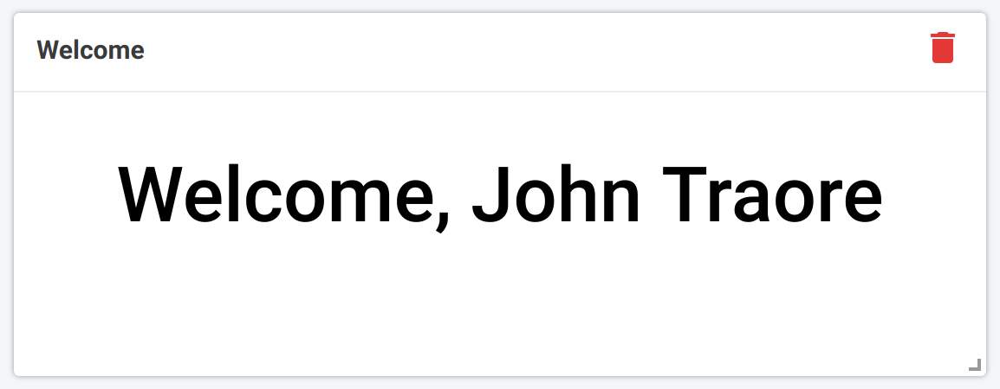

# DHIS2 dashboard app example
Displays a welcoming message containing the user's display name.


## Install
```bash
npm install
# or
yarn install
```

## Develop
You need to log in to whatever `developmentServer` is set to in [src/index.js](./src/index.js#L6).
```bash
npm start
# or
yarn start
```

## Build
```bash
npm run build
# or
yarn build
```
